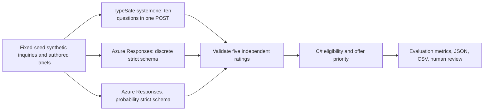

# ContextWindow.AI.TruckInquiryBenchmark

A .NET 10 console sample for comparing TypeSafe jev-1.13.0 with GPT gpt-6-luna on **fictional dedicated-truck inquiries** for the invented Northline Freight sales desk.
The program keeps model extraction separate from the C# offer ranking policy.
It never dispatches a truck or reads real customer, employer, or aviation records. No empirical model result is included here.



## Run

From this directory with the .NET 10 SDK:

```sh
dotnet restore ContextWindow.AI.TruckInquiryBenchmark.slnx
dotnet format ContextWindow.AI.TruckInquiryBenchmark.slnx --verify-no-changes
dotnet test ContextWindow.AI.TruckInquiryBenchmark.slnx --configuration Release
dotnet run --project src/ContextWindow.AI.TruckInquiryBenchmark --configuration Release -- --size 100 --mock
```

Use `--size 1000 --mock` for the larger deterministic fixture. Output is written to ignored `artifacts/` by default;
`--out` changes the directory. The generated files are ignored when written inside this sample; keep `--out` inside the
sample if you want that protection. `--mock` forces a no-network demonstration without reading live provider settings.
Use `--limit 3 --live` for a clearly labeled, incomplete provider-contract probe of B, A and C before a full
100-inquiry live run. Limited probes omit warmups; the full run warms each provider with two separately authored
tuning inquiries before timing its evaluation batch. `--live` and `--mock` cannot be combined.
Practical (TypeSafe native vs GPT discrete) and probability (TypeSafe native vs GPT distributions) run sequentially, each with
equal two-request concurrency per provider, its own warmups, measured batch, repeats, and result files in `artifacts/practical/`
and `artifacts/probability/`. The same TypeSafe model is called separately in both modes; do not add its two billed totals
when estimating a single-mode deployment. Each mode writes `fixtures.json` with the selected synthetic inquiries' complete messages, conversation/context, offers,
and operational flags. `reference-labels.json` contains the five authored dimension levels/evidence states and C#
reference ranking eligibility, status, truck and score for only the independent cases in the selected run (ten in a
full run, three with `--limit 3`). Both
files are generated from the same fixed-seed cases used for evaluation; neither is a provider result or a checked-in snapshot.
`aggregate.json` summarizes the measured calls and each provider's `ratingMode`. `aggregate.csv` has one row per provider and rubric
dimension, repeating the provider-level metrics (mode, provider top inquiry ID, independent-reference top inquiry ID,
reference top/rank checks, cross-provider top agreement, repeat metrics, request failures, batch duration, successful
inquiries per second, latency, tokens and estimated cost per 1000). Dimension columns include accuracy, missing and contradictory detection
counts with their authored-reference denominators, Brier and calibration buckets. Empty CSV cells mean not applicable or unavailable,
not zero. `requests.json` records validated per-request ratings, rankings, `RatingMode`, and the actual returned `Model` (null for mock
or failed requests). `requests.csv` records per-request timing, token counts, retries and ranking status. CSV fields are quoted when
needed; numbers use invariant formatting. Input and label artifacts contain the authored fictional messages and context;
request and aggregate artifacts contain derived ratings and synthetic case IDs. None contain API keys or raw provider
responses. Console explanations are fixed C# templates, not extra model calls.

The root `examples/reference-manifest.json` freezes the authored levels for all 100 fixed-seed evaluation variants
before a live call. It is part of the uploaded source digest. The console emits one compact `CW_BENCHMARK_V1` JSON
line per mode with those reference levels, validated per-call levels, status, elapsed time, returned model ID and
aggregate. The admin harness checks both modes against the source manifest, then reconciles field matches, failures
and request latencies before treating those measures as claim-supporting.
They contain no customer messages, provider keys or raw responses. A successful command without complete reconciled
records remains execution-only evidence. The records do not validate real sales outcomes or unmeasured prices.

With `--mock`, or without all live variables, the program runs a clearly labeled **mock-only demonstration** using the authored labels,
with no provider calls.
Perfect mock accuracy is a harness check, **not evidence** that any provider performs well. To require live execution, pass `--live`:
missing or invalid settings fail before any request.

Live mode needs these environment variables (supply your own values outside the repository):

| Variable | Meaning |
| --- | --- |
| `TYPESAFE_ENDPOINT` | Complete HTTPS `/v1/systemone` URL, never a base URL |
| `TYPESAFE_API_KEY` | API key; sent as bearer authorization |
| `TYPESAFE_MODEL` | Deployed TypeSafe model ID, e.g. `jev-1.13.0` |
| `TYPESAFE_INPUT_USD_PER_MILLION` | Optional USD per million TypeSafe input tokens; output is treated as free for this estimate |
| `AZURE_OPENAI_ENDPOINT` | Azure HTTPS resource base URL; the client appends `/openai/v1/responses` |
| `AZURE_OPENAI_API_KEY` | Azure API key; sent in `api-key` header |
| `AZURE_OPENAI_DEPLOYMENT` | Azure deployment name, sent as the Responses `model` |
| `AZURE_OPENAI_INPUT_USD_PER_MILLION` | Optional USD per million uncached input tokens |
| `AZURE_OPENAI_CACHED_USD_PER_MILLION` | Optional USD per million cached input tokens |
| `AZURE_OPENAI_OUTPUT_USD_PER_MILLION` | Optional USD per million output tokens |

TypeSafe sends one POST to the configured complete `/v1/systemone` URL with `Authorization: Bearer [REDACTED] and
`{state: <customer message>, model: <TYPESAFE_MODEL>, questions: {...}}`. `questions` is an object of ten IDs: for each of the
five dimensions, `<name>.score` has `type: "score"`, evidence-only instructions and a `criteria` array containing the three
descriptive levels below; `<name>.sufficiency` has `type: "choice"`, instructions and a `criteria` object with fully described
`sufficient`, `missing` and `contradictory` options. GPT receives the exact same level descriptions in its system instructions.

The TypeSafe response has an `answers` object keyed by those ten IDs. A sufficient score answer contains
`{probabilities: {"0": p0, "1": p1, "2": p2}, score: number, confidence: number}` and its sufficiency answer contains
`{choice: "sufficient"}`. For `missing` or `contradictory` choices, the score answer is ignored, with no level or distribution.
For sufficient evidence, the validated distribution is retained and its argmax is the level; invalid distributions invalidate
the call. Root `usage.input_tokens` and `usage.output_tokens` supply token counts when reported. Azure Responses uses
`text.format` with `json_schema`, `strict: true`, `store: false`, and parses `output_text` from a completed response.
Both providers require root `response.model` to exactly match the requested model; missing or substituted IDs invalidate the call.
TypeSafe returns score probabilities and a practical discrete argmax while retaining the distribution. GPT-discrete requests an
integer level (`practical-discrete` in JSON); GPT-probability requests a three-value distribution (`probability` in JSON).
TypeSafe's trials retain native probabilities in both modes; the aggregate mode is labeled `practical-native` or
`probability-native` to keep its two measurements distinct.
API messages and keys are not printed.

## Authored fixture

The first three of ten independently authored evaluation cases are B, A and C, in that order. Their latest customer messages
and first offer values are exact and never randomized:

| ID | Exact quoted customer message | Revenue | Precomputed contribution |
| --- | --- | ---: | ---: |
| B | "Our carrier cancelled. The 18 pallets are ready and we need a dedicated dry van tomorrow. The rate is approved. Send the booking confirmation if you can collect between 8 and 10 am. We can also load this afternoon if that helps." | $3,800 | $1,500 |
| A | "Getting prices for a shipment next month. Production hasn't confirmed the date or final pallet count. Please send your best rate." | $6,200 | $700 |
| C | "The shipment is confirmed but our purchasing manager still needs to approve the rate. Pickup must be at 7 am with no flexibility. Please respond by this afternoon." | $5,100 | $1,200 |

Each inquiry contains its ID, latest customer message and conversation, relevant customer history (or an explicit absence of prior
history), pickup, delivery and cargo details where supplied, and an explicit list of missing information. Unknown locations, dates,
cargo contents, approval and flexibility stay unknown; a deadline to respond is not a booking request. B is a ready return load that
replaces an otherwise empty return, A has substantial empty positioning but missing approval and pickup flexibility, and C has a
confirmed shipment with approval outstanding, fixed 7 am pickup and no explicit booking intent. C has a feasible candidate truck
competing with synthetic pending shipment `PENDING-C-01`; its schedule requires dispatch review. B is the first eligible reference
action, not A's larger revenue or C's response deadline. A's exact price request is booking level 0: exploring without booking intent.

Each authored inquiry includes a second candidate offer with prechecked revenue, contribution, empty-mile cost, positioning description,
equipment compatibility, and `feasible`, `blocked` or `unresolved` feasibility. The synthetic alternative adds $180 revenue and $110
contribution, with $410 modeled empty-mile cost rather than $320; no mileage distance is asserted. A's alternative has unresolved
timing, C's alternative has unresolved availability against the competing shipment, and D's alternative is incompatible and blocked.
The model sees only the verbatim latest customer message and identifies five evidence-based ratings; C# excludes blocked or unresolved
offers, ranks eligible offers and queues reviews. It does not ask the model to compute positioning, contribution, feasibility or conflicts.

The fixed seed (7130) generates exactly 100 evaluation inquiries by default, or 1000 with `--size 1000`. Later repeated variants
add a deterministic 0..99 synthetic amount to revenue and contribution without changing the label or message. Only the first ten
distinct authored evaluation cases have **independent references** for top-agreement and top-ten overlap. Two additional, uniquely
authored tuning inquiries (T1 and T2) have their own messages, multi-turn conversations and explicit five-dimension ratings.
They are labeled `tuning`, used only for full-run warmups, and excluded from the evaluation count and all measured metrics.
Repeated evaluation variants share messages with their originating template, so they are not independent validation examples.
E's authored earlier turn confirms a shipment for tomorrow, while its later turn says it may be cancelled; G's earlier turn requires
pickup today, while its later turn denies any deadline. These are fictional authored turns, not live customer facts. F is an untrusted
prompt-injection attempt, and H is blocked by an authored operational rule. Label sufficiency is authored separately for every dimension.

| Dimension | 0 | 1 | 2 |
| --- | --- | --- | --- |
| Booking | Only exploring options; no intent to book | Considering or comparing trucks; not ready to book | Ready to book if stated conditions are met |
| Shipment | Speculative; not yet planned | Planned but details or commitment unsettled | Explicitly confirmed as real and ready |
| Urgency | No prompt need or deadline | Deadline without immediate action | Immediate action needed or competing carrier ready |
| Pickup flexibility | Fixed pickup time; no alternatives allowed | Different time considered under conditions | Explicitly accepts a stated time range |
| Approval | Explicitly outstanding or not requested | Conditional or partial approval | Explicitly approved or authorized to book |

Each dimension also has its own evidence state: `sufficient`, `missing`, or `contradictory`. The latter two have **no numerical level**,
are not treated as zero or neutral, and force manual review. Blocked cases cannot be ranked. Approval and booking gate eligibility,
not score twice. With nonnegative weights summing to one, the score is:

```text
100 * (0.55 * clamp(precomputed contribution / 2000, 0, 1)
  + 0.20 * shipment / 2 + 0.15 * urgency / 2
  + 0.10 * flexibility / 2 [only for alternative offers])
  / (0.55 + 0.20 + 0.15 + 0.10 [only for alternative offers])
```

Weights are configurable via `PriorityWeights`; only applicable weights are in the denominator, so a primary offer can reach 100
without pickup flexibility. A fixed pickup excludes alternative offers. Unknown, contradictory or pending evidence
and authored schedule conflicts require review. C# selects only eligible offers and emits review explanations; the model cannot choose
a truck or dispatch one. Independent inquiry priorities do not optimize the whole fleet, and a rubric score is not a booking probability.

## Measurement boundaries

- Both sequential modes see the same 100 evaluation inquiries (or 1000 at scale). Two distinct tuning warmups per provider are excluded
  from the timed batch; `--limit` probes skip warmups and remain incomplete. Measurement schedules evaluation calls in rotating provider
  order with two in-flight requests per provider; retryable 429/503 and timeouts have at most two bounded retries. Two additional
  repeat sets of the same five evaluation inquiries are collected after the base calls and excluded from throughput and quality metrics.
- Per-dimension accuracy includes correct evidence state and, for sufficient references, an exact discrete level or probability argmax.
  Probability Brier score is the mean squared error across the three mutually exclusive levels, only for sufficient references with
  valid distributions. Expectations `p1 + 2*p2` are computed locally. For probability modes only, sufficient authored references
  with valid predicted distributions are split by the highest **scoring-category** probability (at least 0.8 vs below 0.8), with
  correct argmax counts, totals and accuracy in each bucket. These probabilities are neither booking-outcome likelihoods nor a
  provider's self-reported confidence. Empty buckets have null accuracy. The accuracy denominator includes every evaluation call,
  including failed/invalid calls (which are incorrect); Brier and calibration exclude failures. Missing/contradictory correct counts
  are accompanied by the number of evaluation calls with each authored evidence state, including failed calls.
- `providerTopInquiryId` is the provider's highest-scored evaluation inquiry, including repeated variants;
  `independentReferenceTopInquiryId` is the top rankable authored reference. `topAgreement` compares the predicted top and reference
  top **only among the ten independent evaluation references**, and is null if either side has no rankable inquiry. It does not
  compare a repeated variant to an independent reference. `providerTopAgreement` reports whether all providers chose the same
  overall evaluation top (null with fewer than two providers or an unrankable provider); agreement is not correctness. Top-ten
  overlap is null unless both independent reference and predicted lists contain ten rankable inquiries. High-priority downrank
  checks whether the reference first fell outside the predicted independent top ten. Review and blocked cases are never ranked.
- `batchDurationSeconds` is the wall-clock timed evaluation batch, shared across providers. `completedInquiriesPerSecond` divides
  each provider's successful evaluation inquiries by that shared duration, not scheduled calls; failed calls remain in the
  accuracy denominator. Median and nearest-rank p95 cover measured evaluation request durations, including retries and failures.
  API errors, invalid payloads, retries, and terminal timeouts are separate. Repeatability is the fraction
  of complete pairs whose two assessments both exactly match the base assessment. Ranking variation separately compares each
  repeat set's scored-inquiry ordering with the base ordering of the same five inquiries, using the same deterministic score/ID
  tie-break; it reports changed sets, compared sets and their ratio. If any of the five base or repeated calls fails, or none is
  rankable, no ordering comparison is reported. The repeated inquiries are not independent evidence of model quality.
- Cost per 1000 is a **price-based estimate** from reported input tokens for TypeSafe (output treated as free)
  and reported token usage for GPT, with cached tokens priced separately. Set `TYPESAFE_INPUT_USD_PER_MILLION` to
  estimate TypeSafe cost; leave it unset for null/unmeasured cost, not zero. GPT cost is null unless all three optional Azure
  price rates are supplied. An explicitly configured zero is a measured price, not a fallback. Missing token usage or mock mode
  yields null cost. Token usage from failed/retried attempts cannot
  be recovered by this harness and is excluded from the estimate. Warmups and
  repeatability calls can still incur real charges but are excluded from measured cost. No client-side response caching is enabled;
  the API may report cached input tokens. Network conditions, backend caching, model deployment drift, and provider billing can affect
  live results. The harness makes no claim that prices, performance, or outputs are comparable until a real run is reviewed.

MIT licensed; see [LICENSE](LICENSE).